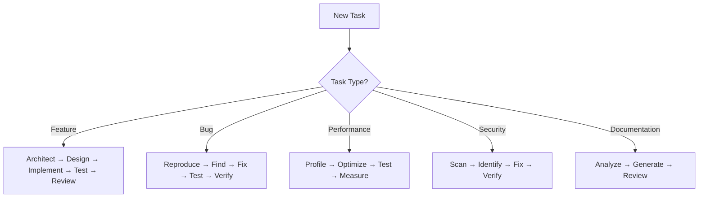
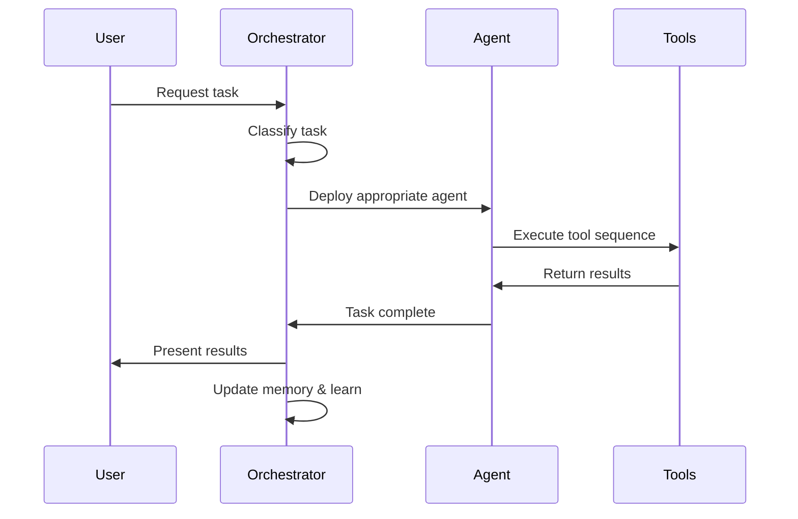

# Claude Code Unified System Orchestrator

## System Overview
This orchestrator ensures all Claude Code components work harmoniously as one integrated system, implementing official best practices for memory management, context optimization, and efficient task execution.

## Core System Principles

### 1. Memory Management Strategy
Based on official Claude Code documentation, memory is loaded in this hierarchy:
1. **Enterprise Policy** → Organization-wide standards
2. **Project Memory** → `./CLAUDE.md` (team-shared)
3. **User Memory** → `~/.claude/CLAUDE.md` (personal)

### 2. Context Management Best Practices

#### Context Window Optimization
- **Token Budget**: ~200k tokens available
- **Compaction Threshold**: 50k tokens (auto-compact)
- **Clear Strategy**: Use `/clear` between unrelated tasks
- **Compact Strategy**: Use `/compact` at natural breakpoints

#### Context Preservation Rules
```yaml
always_preserve:
  - Current task definition
  - Active TODO list
  - Recent error context
  - Critical project configuration

auto_remove:
  - Completed task details
  - Old conversation history
  - Redundant file contents
  - Duplicate information
```

### 3. Intelligent Task Routing

#### Task Classification System
```javascript
const taskRouter = {
  // Feature Development
  "new feature": ["architect", "api-designer", "test-writer", "code-reviewer"],
  
  // Bug Fixing
  "bug|error|issue": ["bug-finder", "test-writer", "code-reviewer"],
  
  // Performance
  "slow|optimize|performance": ["performance-optimizer", "refactoring-assistant"],
  
  // Security
  "security|vulnerability": ["security-scanner", "code-reviewer"],
  
  // Documentation
  "document|docs|readme": ["documentation-writer"],
  
  // Infrastructure
  "deploy|ci/cd|docker": ["devops-engineer"],
  
  // Frontend
  "ui|component|react|vue": ["frontend-specialist"],
  
  // Database
  "database|query|schema": ["database-expert"]
};
```

## System Self-Deployment Protocol

### Initialization Sequence
1. **Environment Detection**
   ```bash
   # Automatically detect and configure for:
   - Operating System
   - Available tools
   - Project type
   - Existing configuration
   ```

2. **Dependency Analysis**
   ```bash
   # Check for required tools
   - Node.js version
   - Package managers (npm, yarn, pnpm)
   - Git configuration
   - Language runtimes
   ```

3. **Auto-Configuration**
   ```bash
   # Based on project analysis:
   - Detect framework (React, Vue, Angular, etc.)
   - Identify test runners
   - Configure linters
   - Set up formatters
   ```

## Workflow Automation Engine

### Automatic Trigger System
```json
{
  "triggers": {
    "on_file_save": {
      "*.js|*.ts": ["lint", "format", "typecheck"],
      "*.test.*": ["run_tests"],
      "*.md": ["spell_check"]
    },
    "on_commit_attempt": {
      "actions": ["security-scan", "test-suite", "code-review"]
    },
    "on_pr_creation": {
      "actions": ["comprehensive-review", "documentation-check"]
    },
    "on_error_detection": {
      "actions": ["bug-finder", "test-writer"]
    }
  }
}
```

### Intelligent Decision Tree


## Memory Optimization Strategies

### 1. Smart Caching
```json
{
  "cache_strategy": {
    "duration": 900,
    "cache_items": [
      "file_structure",
      "dependencies",
      "test_results",
      "lint_results"
    ],
    "invalidate_on": [
      "file_changes",
      "dependency_updates",
      "configuration_changes"
    ]
  }
}
```

### 2. Selective Loading
```yaml
load_patterns:
  always:
    - CLAUDE.md
    - package.json
    - current_file
  
  on_demand:
    - test_files
    - documentation
    - configuration
  
  lazy:
    - node_modules
    - build_artifacts
    - large_assets
```

### 3. Context Pruning
```javascript
// Automatic context pruning rules
const contextPruning = {
  remove_after: {
    "search_results": "2_uses",
    "file_contents": "5_minutes_unused",
    "error_traces": "after_fix",
    "test_output": "after_success"
  },
  
  never_remove: [
    "active_task",
    "todo_list",
    "critical_errors",
    "user_instructions"
  ]
};
```

## Parallel Processing Optimization

### Tool Batching Strategy
```javascript
// Execute tools in parallel when possible
const parallelExecution = {
  "analysis_phase": [
    "grep_for_patterns",
    "read_related_files",
    "check_dependencies"
  ],
  
  "validation_phase": [
    "run_tests",
    "run_linter",
    "check_types"
  ],
  
  "review_phase": [
    "security_scan",
    "performance_check",
    "code_quality"
  ]
};
```

## Self-Healing Mechanisms

### Error Recovery
```yaml
error_recovery:
  test_failure:
    - Analyze failure output
    - Identify root cause
    - Generate fix
    - Re-run tests
    - Verify success
  
  build_failure:
    - Check dependencies
    - Verify configuration
    - Fix syntax errors
    - Retry build
  
  lint_errors:
    - Auto-fix when possible
    - Generate manual fixes
    - Apply fixes
    - Re-run linter
```

### Health Monitoring
```json
{
  "health_checks": {
    "frequency": "before_each_task",
    "checks": [
      "context_size",
      "memory_usage",
      "tool_availability",
      "dependency_status"
    ],
    "actions": {
      "context_overflow": "auto_compact",
      "memory_high": "clear_cache",
      "tool_missing": "suggest_install",
      "dependency_outdated": "suggest_update"
    }
  }
}
```

## Intelligent Context Switching

### Task State Management
```javascript
const taskStateManager = {
  saveState: () => {
    // Before switching tasks
    return {
      current_files: getCurrentFiles(),
      todo_list: getTodoList(),
      context: getRelevantContext(),
      progress: getProgress()
    };
  },
  
  restoreState: (state) => {
    // When resuming task
    loadFiles(state.current_files);
    restoreTodos(state.todo_list);
    loadContext(state.context);
    continueFrom(state.progress);
  }
};
```

## Performance Metrics Tracking

### Key Performance Indicators
```yaml
track_metrics:
  efficiency:
    - tasks_completed_per_session
    - average_completion_time
    - error_rate
    - retry_count
  
  quality:
    - test_coverage_improvement
    - bug_detection_rate
    - code_quality_score
    - documentation_completeness
  
  resource_usage:
    - token_consumption
    - context_size
    - tool_invocations
    - cache_hit_rate
```

## Adaptive Learning System

### Pattern Recognition
```javascript
const patternLearning = {
  track_patterns: {
    "common_errors": "Store and prevent",
    "successful_fixes": "Reuse solutions",
    "user_preferences": "Adapt behavior",
    "project_conventions": "Follow automatically"
  },
  
  adapt_behavior: {
    "repeated_tasks": "Create shortcuts",
    "common_workflows": "Optimize paths",
    "frequent_tools": "Prioritize loading",
    "user_corrections": "Learn preferences"
  }
};
```

## System Commands

### Quick Actions
```bash
# System health check
claude system:health

# Optimize context
claude system:optimize

# Clear and reset
claude system:reset

# Performance report
claude system:metrics

# Update configuration
claude system:config
```

## Integration Points

### Tool Coordination
All tools work together through:
1. **Shared context** - Common memory pool
2. **Event system** - Tools trigger other tools
3. **Result passing** - Output feeds next tool
4. **State synchronization** - Consistent system state

### Workflow Example


## Best Practices Implementation

### 1. Research-Plan-Implement Pattern
```yaml
workflow:
  research:
    - Understand requirements
    - Analyze codebase
    - Find similar patterns
  
  plan:
    - Design solution
    - Break into subtasks
    - Estimate complexity
  
  implement:
    - Write tests first
    - Implement solution
    - Verify and review
```

### 2. Test-Driven Development
```yaml
tdd_workflow:
  - Write failing test
  - Implement minimal code
  - Make test pass
  - Refactor if needed
  - Repeat
```

### 3. Continuous Quality Assurance
```yaml
quality_gates:
  pre_commit:
    - Lint check
    - Type check
    - Test suite
    - Security scan
  
  post_implementation:
    - Code review
    - Performance check
    - Documentation update
```

## System Maintenance

### Self-Maintenance Tasks
```json
{
  "maintenance": {
    "daily": [
      "Clear old cache",
      "Compact memory",
      "Update patterns"
    ],
    "weekly": [
      "Analyze performance",
      "Optimize workflows",
      "Update documentation"
    ],
    "monthly": [
      "Review agent effectiveness",
      "Update best practices",
      "System health audit"
    ]
  }
}
```

## Conclusion
This unified orchestrator ensures Claude Code operates as a cohesive, intelligent system that:
- Self-deploys based on environment
- Manages memory and context efficiently
- Routes tasks intelligently
- Learns and adapts from usage
- Maintains optimal performance
- Follows official best practices

The system is now configured to work harmoniously as one integrated whole, maximizing efficiency and code quality.